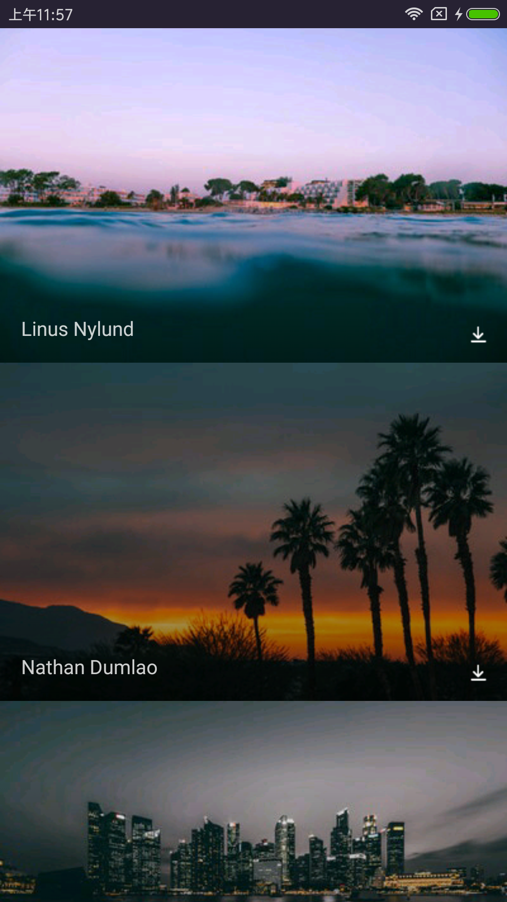
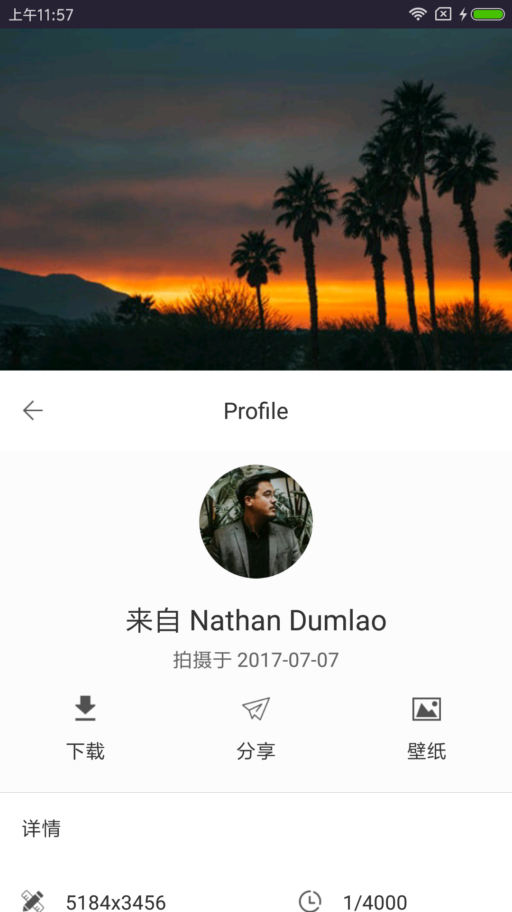
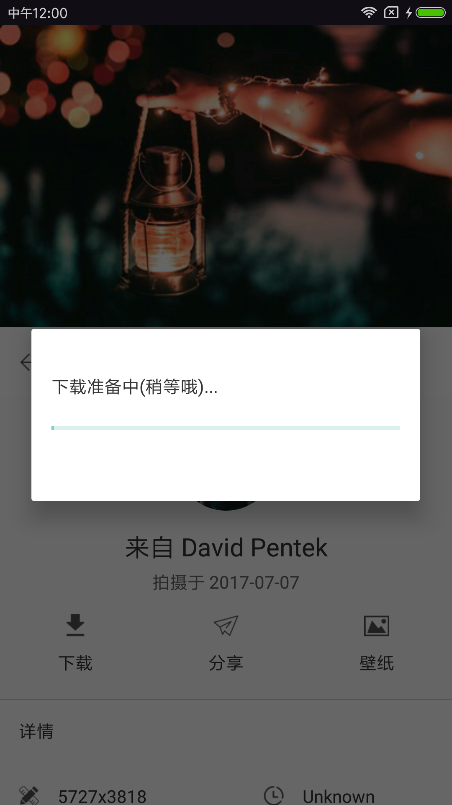
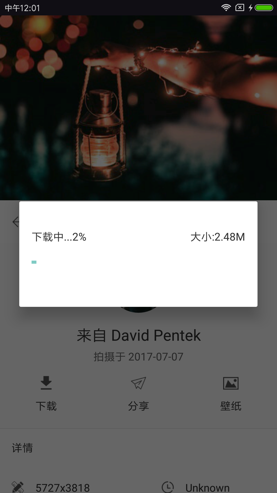
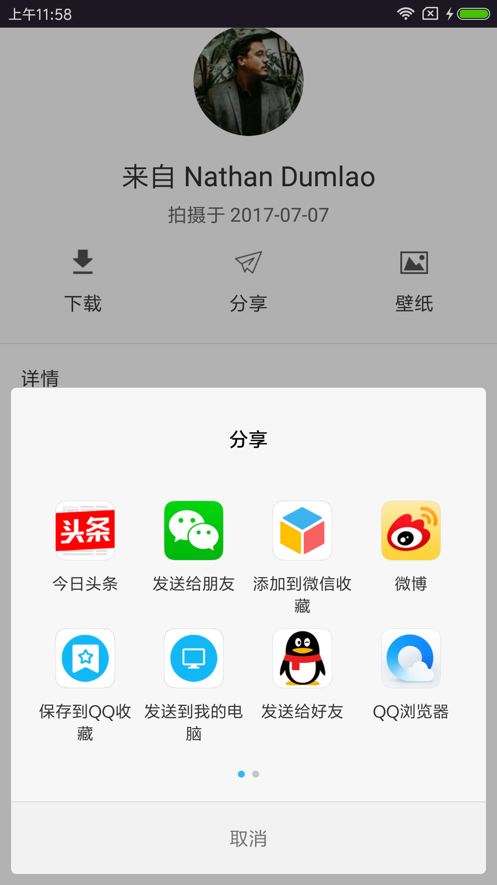
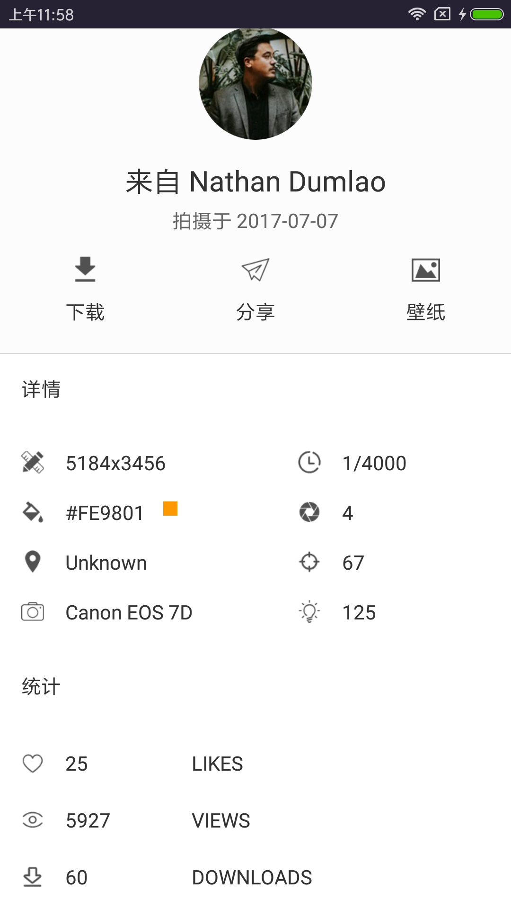
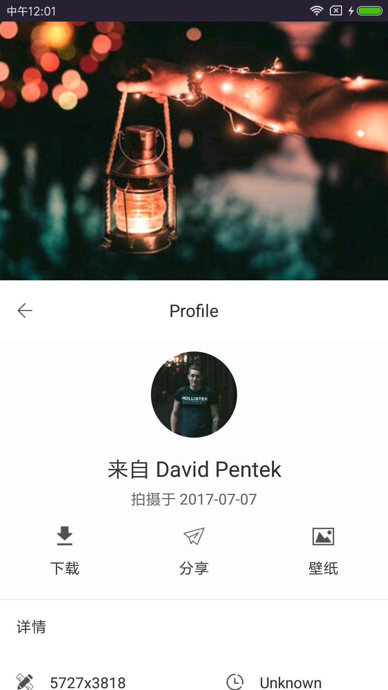
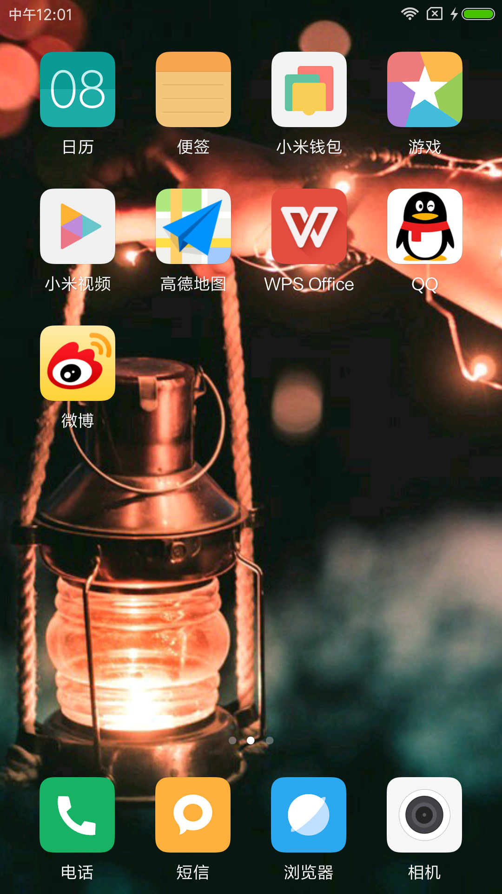

#### NicePhoto

一款超简单的图片浏览+设置壁纸+图片下载的App。
拥有数以百万计的图片资源，来自 https://unsplash.com/

NicePhoto for Kotlin  + RxJava + Retrofit

api文档：https://unsplash.com/documentation#user-authentication  

#### 功能介绍

app非常简单，只有2层界面，是在学习Kotlin时的练手项目，主要功能有：
1. 图片浏览
2. 图片下载
3. 分享
4. 设置壁纸

#### Apk下载

#### 截图

#### Thanks

感谢JokAr的知乎日报项目提供参考和学习：https://github.com/a1018875550/ZhihuDaily
感谢Mysplash项目提供UI参考：https://github.com/WangDaYeeeeee/Mysplash

#### About me
An android developer in GuangZhou
简书：[http://www.jianshu.com/users/286f9ad9c417/latest_articles](http://www.jianshu.com/users/286f9ad9c417/latest_articles)
Email:386707112@qq.com
If you want to make friends with me, You can give me a Email and follow me。

#### License
Copyright 2017 L_Xian

Licensed under the Apache License, Version 2.0 (the "License"); you may not use this file except in compliance with the License. You may obtain a copy of the License at

http://www.apache.org/licenses/LICENSE-2.0

Unless required by applicable law or agreed to in writing, software distributed under the License is distributed on an "AS IS" BASIS, WITHOUT WARRANTIES OR CONDITIONS OF ANY KIND, either express or implied. See the License for the specific language governing permissions and limitations under the License.